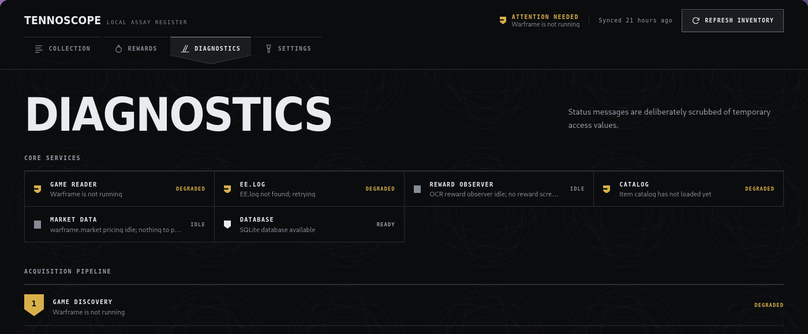

<div align="center">

# TennoScope

**A Linux-first Warframe companion. No Overwolf, no account, no telemetry.**

Reads your collection straight off the running game and tells you which relic reward is
actually worth taking — while the timer is still going.

[](https://github.com/Deftera186/tennoscope/actions/workflows/ci.yml)
[](LICENSE)
[](#requirements)

</div>

---

## The four-card problem

A relic cracks. You have seconds, four rewards, and no idea which one is worth anything.
TennoScope reads the cards off the screen and puts the answer under them — **in platinum and in
ducats, called separately, because they usually disagree.**


Prices are live from warframe.market, quoted from **sellers who are actually online** — an offline
listing is a price nobody can trade at. The whole relic pool is priced while the mission is still
running, so the numbers are already local when the screen appears. Untradeable items get a dash,
not a guess.

The strip is non-focusable and click-through. It never takes input from the game.

## Your collection, held locally

1,100 items with real artwork, mastery state, search and filters. No spreadsheet, no third-party
account, no upload.


It refreshes itself: TennoScope notices Warframe starting, watches the game's own log for a
completed inventory sync, and re-reads. The log is only a trigger — nothing is scraped from it.

## When something breaks, it says so



Every stage reports its own state, and status messages are scrubbed of anything sensitive before
they are shown. Four states, distinct by shape as well as colour: **ready**, **idle** (working,
nothing to do yet), **degraded**, **failed**.

---

## Read this before you install it

> [!IMPORTANT]
> TennoScope reads the Warframe process's memory to obtain a session token, then asks Warframe's
> own inventory endpoint for your collection. **It never writes to the game, and never modifies,
> automates, or influences gameplay.** Digital Extremes has not endorsed this, and any third-party
> tool that inspects a game process may carry account-policy or anti-cheat risk.

The risk is real but small, and it is worth being precise about why. This is the same technique
used by tools DE has publicly tolerated for years — [AlecaFrame](https://alecaframe.com/) is the
best-known, and there are others. Overwolf-hosted overlays are explicitly permitted. Nothing here
goes further than those do: no memory writes, no injection, no input automation, no game files
touched.

But *tolerated* is not *authorized*. DE has never published a rule that makes this safe in
writing, and only they can. If you are not willing to accept that, do not run this — or any of the
others.

TennoScope shows this disclosure on first run and does nothing at all until you accept it.

## Install

No release is published yet. Build it:

```bash
corepack enable
cd app && pnpm install --frozen-lockfile
pnpm tauri build          # AppImage, .deb and .rpm land in target/release/bundle/
```

Per-distribution prerequisites, plus Arch and Gentoo recipes, are in
[`packaging/`](packaging/README.md).

### Requirements

- **Linux**, with Warframe running through Wine or Proton and logged in.
- Permission to inspect your own game process — see [Yama](#process-permissions) if acquisition
  fails.
- For the reward overlay: `xwininfo`, `import`, **ImageMagick 7** (`magick`, not the v6 `convert`),
  and `tesseract` with English data. `swaymsg` is used for placement where present.
- Network access for the inventory request, the item catalog, and market prices. A validated
  catalog is cached for offline use.

To build: Rust 1.85+, Node 20.19+, pnpm 10, and the Tauri 2 Linux libraries.

### What is not done yet

Stated plainly, because you will hit these:

| | |
| --- | --- |
| **Compositors** | Capture works anywhere X11 does (Warframe is an XWayland client under Proton). Overlay *placement* reads the game rectangle from `swaymsg` — everywhere else, including Hyprland, it falls back to centring on the primary monitor. |
| **Displays** | Card geometry is calibrated on 16:9 and scales by window width. Ultrawide is untested and may drift. |
| **Platforms** | Linux `/proc` only. No Windows or macOS acquisition adapter, and none planned. |
| **Language** | English reward names only. |
| **Durability** | The acquisition technique depends on undocumented game behaviour and may need maintenance after a Warframe update. |

## Privacy

- The account identifier and nonce are **session credentials**. They stay in memory, are redacted
  from `Debug` and `Display`, and are never written to the database or any log.
- Raw inventory responses are validated in memory and not persisted.
- What is stored on disk: your normalized collection snapshot, setup state, and health metadata.
- No telemetry, no analytics, no remote account, no crash reporting.
- Network requests go to the pinned Warframe inventory origin, the pinned catalog source, and
  warframe.market. Nothing else.

## Process permissions

TennoScope must read `/proc/<pid>/maps` and `/proc/<pid>/mem` of your own game process.

```bash
cat /proc/sys/kernel/yama/ptrace_scope   # 0 normally permits same-user inspection
```

At `1` or higher the kernel may refuse, because TennoScope is not Warframe's parent. To test until
reboot:

```bash
sudo sysctl kernel.yama.ptrace_scope=0
```

That weakens ptrace isolation for every same-user process while it is set — decide whether a
permanent change fits your machine. **Do not run TennoScope as root, do not make the AppImage
setuid, and do not grant it capabilities to work around the policy.** Also check that Warframe and
TennoScope run as the same Unix user; sandboxed launchers impose `/proc` restrictions that no Yama
change will fix.

## Development

```bash
cd app && pnpm tauri dev
```

The full check, which is exactly what CI runs:

```bash
cargo fmt --all --check
cargo clippy --workspace --all-targets -- -D warnings
cargo test --workspace
cd app && pnpm check
```

The live tests are `#[ignore]`d — no normal test run ever touches a game process.

| | |
| --- | --- |
| [CONTRIBUTING.md](CONTRIBUTING.md) | Conventions, and the two rules that are not negotiable |
| [SECURITY.md](SECURITY.md) | What counts as a vulnerability in a tool with no server |
| [docs/](docs/README.md) | Design decisions and the live research behind them |
| [RELEASING.md](RELEASING.md) | Versioning and how a release is cut |
| [CHANGELOG.md](CHANGELOG.md) | |

## License

[GPL-3.0-only](LICENSE). Warframe, its data and its artwork remain the property of Digital
Extremes. Runtime catalog data has its own upstream licensing — see
[THIRD_PARTY_NOTICES.md](THIRD_PARTY_NOTICES.md).

TennoScope is unofficial and not affiliated with or endorsed by Digital Extremes.
