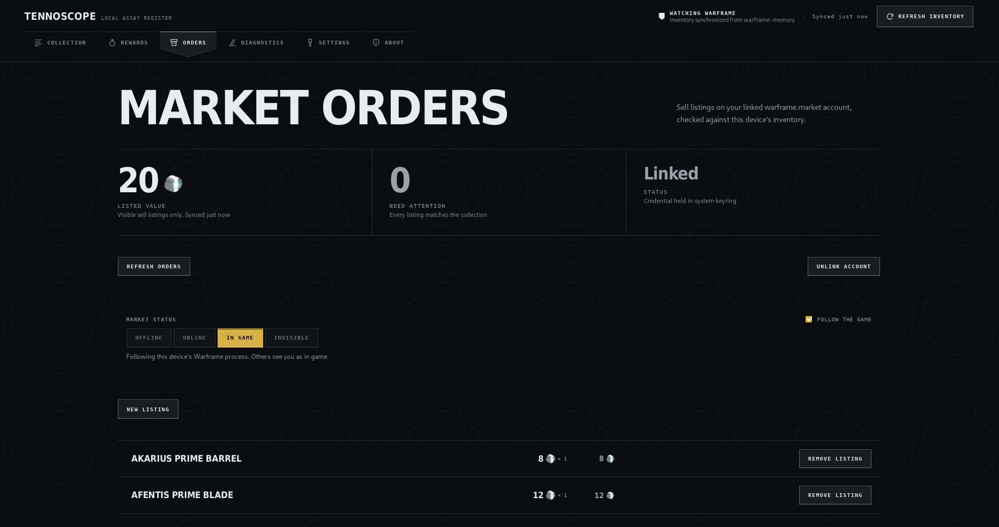

# TennoScope

**A free and open-source, Rust-based Warframe companion for Linux, Windows and the Steam Deck.
No Overwolf, no account, no telemetry.**

## Reward overlay

Platinum and ducats under every reward card, live. Cards are marked as owned, not owned,
or needed for mastery. The squad's entire relic pool is priced while the mission is still
running, so the numbers are up the moment the screen appears, and only sellers who are
actually online are counted. The overlay is click-through and never takes focus from the
game.

## Collection

Everything the game says you own: frames, weapons, companions, prime parts, relics,
resources, blueprints, vehicles, mods and arcanes. Artwork, mastery state, search and
filters, stored locally. It keeps itself current: TennoScope notices the game start,
waits for the inventory sync, and re-reads. No exports, no manual scans.

Values come from warframe.market's daily trade dump: one download a day, no request per
item. Mods and arcanes are priced by rank, since that is how they sell. Next to the
market-rate total sits a second figure: what the market would actually take, based on
how much of each item really trades rather than asking prices summed up.

Prime parts also carry their ducat value beside platinum — Baro Ki'Teer's posted price
for the part, totaled across the stack and across the whole collection, and kept on
missing parts too, since it is what tells you which relic reward to take. A switch in
the toolbar hides them if you would rather read platinum alone, and the two value
sorts — platinum and ducats — are named and marked by their own metal.

## warframe.market integration

Off by default. Link your account, by signing in or by pasting a token from a signed-in
browser, and your orders sit next to your collection: what is listed, how fresh the
prices are, and which orders no longer match what you own. Listing, delisting and
changing your online status all happen in the app.

## Install

| System | How |
| --- | --- |
| Windows | [Installer](https://github.com/Deftera186/tennoscope/releases/latest) from the latest release |
| Debian, Ubuntu, Fedora | [`.deb` or `.rpm`](https://github.com/Deftera186/tennoscope/releases/latest) from the latest release |
| Arch-based, incl. Steam Deck | `curl -O https://raw.githubusercontent.com/Deftera186/tennoscope/main/packaging/arch/PKGBUILD && makepkg -si` |
| Gentoo | `games-util/tennoscope-bin` from the [`deftera`](https://github.com/Deftera186/deftera-overlay) overlay |
| Any other Linux | [AppImage](https://github.com/Deftera186/tennoscope/releases/latest) from the latest release |

- On Windows, set Warframe's display mode to **Borderless**. In exclusive fullscreen
  nothing can draw over the game, so the overlay will not appear.
- SmartScreen will warn about the unsigned Windows installer. "More info", then
  "Run anyway".
- On Linux, the overlay needs `tesseract` with English data. The collection works
  without it.

The [full install guide](docs/install.md) covers per-distribution details, building from
source, process permissions and known limits.

> [!IMPORTANT]
> **Read this before you run it.** TennoScope reads the Warframe process's memory to
> obtain a session token, then asks Warframe's own inventory endpoint for your
> collection. It never writes to the game and never automates or influences gameplay.
> Digital Extremes has not endorsed this, and any tool that inspects a game process
> carries some account-policy risk. The app shows this disclosure on first run and does
> nothing until you accept it.

## License

[GPL-3.0-only](LICENSE). TennoScope is unofficial and not affiliated with or endorsed by
Digital Extremes. Warframe and its artwork remain the property of Digital Extremes; see
[THIRD_PARTY_NOTICES.md](THIRD_PARTY_NOTICES.md).

[Install guide](docs/install.md) · [Docs](docs/README.md) · [Contributing](CONTRIBUTING.md) · [Changelog](CHANGELOG.md) · [Security](SECURITY.md)

