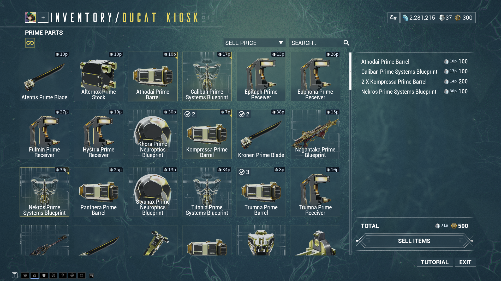

# TennoScope

**A free and open-source, Rust-based Warframe companion for Linux, Windows and the Steam Deck.
No Overwolf, no account, no telemetry.**

## Reward overlay

See platinum and ducats under each reward the moment it appears. TennoScope also marks
what you own, what you are missing and what you still need for mastery. It prices the
whole squad's relic pool using sellers who are online now, without stealing focus from
the game.

## Ducat Kiosk overlay

Before you trade a Prime part for ducats, check what it is worth in platinum. TennoScope
prices the kiosk grid, follows items into your sell list and keeps a running total. Clear
out the duplicates without giving Baro something valuable by mistake.

## Collection

Open one screen for gear, Prime parts, relics, resources, blueprints, mods, arcanes and
more. Looking for one item? Search by name, or filter the collection down to owned,
mastered or missing gear. TennoScope syncs when the game starts - nothing to export and
nothing to scan by hand.

See platinum and ducat values side by side, per item and across your collection. Market
prices come from warframe.market's daily trade data, with mods and arcanes priced at
their actual rank.

Prime parts use Baro Ki'Teer's posted ducat values. Sort by either currency or hide the
ducat figures when you only care about platinum.

## warframe.market integration

Connect warframe.market only if you want to. Once linked, TennoScope puts your orders
beside the inventory they came from. You can spot stale prices or listings for items you
no longer own, then list, delist and change your online status without leaving the app.

## Install

| System | How |
| --- | --- |
| Windows | [Installer](https://github.com/Deftera186/tennoscope/releases/latest) from the latest release |
| Debian, Ubuntu, Fedora | [`.deb` or `.rpm`](https://github.com/Deftera186/tennoscope/releases/latest) from the latest release |
| Arch-based, incl. Steam Deck | `curl -O https://raw.githubusercontent.com/Deftera186/tennoscope/main/packaging/arch/PKGBUILD && makepkg -si` |
| Gentoo | `games-util/tennoscope-bin` from the [`deftera`](https://github.com/Deftera186/deftera-overlay) overlay |
| Any other Linux | [AppImage](https://github.com/Deftera186/tennoscope/releases/latest) from the latest release |

- **Windows:** use Borderless display mode in Warframe. Exclusive fullscreen prevents
  the overlay from appearing. SmartScreen will warn about the unsigned installer; choose
  "More info", then "Run anyway".
- **Linux:** overlays need `tesseract` with English language data. The collection works
  without it.

Need help with a particular distribution, building from source or process permissions?
See the [full install guide](docs/install.md).

> [!IMPORTANT]
> **Read this before you run it.** To fetch your collection, TennoScope reads a session
> token from the Warframe process and sends it to Warframe's own inventory endpoint. It
> never writes to the game, automates an action or affects gameplay. Digital Extremes has
> not endorsed this. Any tool that inspects a game process may carry account-policy risk,
> so the app shows this disclosure on first run and waits for you to accept it.

## License

[GPL-3.0-only](LICENSE). TennoScope is an unofficial project and is not endorsed by
Digital Extremes. Warframe and its artwork belong to Digital Extremes; see
[THIRD_PARTY_NOTICES.md](THIRD_PARTY_NOTICES.md).

[Install guide](docs/install.md) · [Docs](docs/README.md) · [Contributing](CONTRIBUTING.md) · [Changelog](CHANGELOG.md) · [Security](SECURITY.md)

