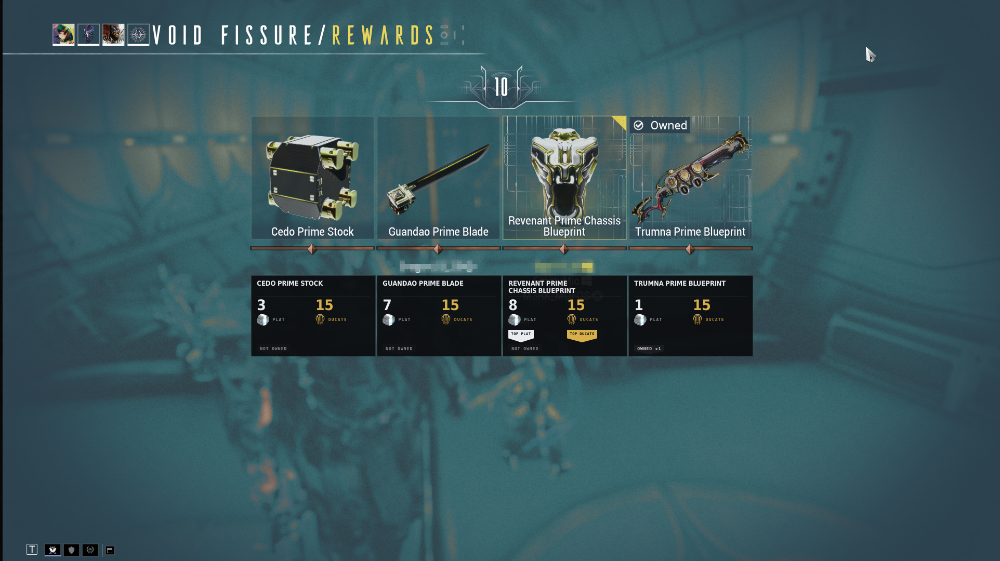
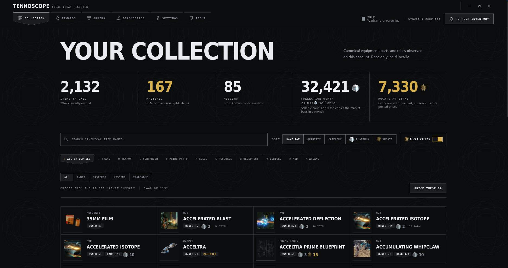

<div align="center">

# TennoScope

**A Warframe companion for Linux and Windows. No Overwolf, no account, no telemetry.**

Reads your collection off the running game and tells you which relic reward is worth taking,
while the timer is still going.

[](https://github.com/Deftera186/tennoscope/actions/workflows/ci.yml)
[](LICENSE)
[](#install)

</div>

---

## Relic overlay

A relic cracks and you get four rewards and fifteen seconds. TennoScope reads the cards off the
screen and puts prices under them, in platinum and in ducats, since those two usually disagree.



Prices come from warframe.market and count only sellers who are actually online, because an
offline listing is a price nobody can trade at. The squad's whole relic pool is priced while the
mission is still running, so the numbers are already local when the screen appears. Untradeable
items get a dash.

The overlay is click-through and never takes focus from the game.

## Collection

Everything the game says you own: frames, weapons, companions, prime parts, relics, resources,
blueprints, vehicles, mods and arcanes. With artwork, mastery state, search and filters, stored
locally.



It refreshes itself. TennoScope notices Warframe starting, watches the game's log for a completed
inventory sync, and re-reads. The log is only a trigger, nothing is scraped out of it.

The whole thing is priced from warframe.market's daily trade dump — one download a day, no request
per item. Mods and arcanes are priced by rank, because the market sells them that way: Serration is
3p unranked and 48p at rank 10, so each rank you hold is its own row, and a half-ranked copy shows
the two ends rather than inventing a number between them.

Under the market-rate total is what the market would actually take. Nobody buys your two hundredth
spare mod, so each stack is also counted at no more copies than the whole game trades in a month.
Settings has a price floor for the rest of it — the 2p mods that do sell, if you will sit down and
arrange every one of those trades by hand.

---

## Read this before you install it

> [!IMPORTANT]
> TennoScope reads the Warframe process's memory to obtain a session token, then asks Warframe's
> own inventory endpoint for your collection. **It never writes to the game, and never modifies,
> automates, or influences gameplay.** Digital Extremes has not endorsed this, and any third-party
> tool that inspects a game process may carry account-policy or anti-cheat risk.

Other community tools have done this for years and DE has not acted on it, but that is not the
same as permission. If you are not willing to accept the risk, do not run this.

TennoScope shows this disclosure on first run and does nothing until you accept it.

## Install

Every option gives you a `tennoscope` command and a desktop entry, except the AppImage, which is
a single file you run directly.

### Gentoo

TennoScope is packaged in the [`deftera`](https://github.com/Deftera186/deftera-overlay) overlay,
which is listed in the official Gentoo overlays database:

```bash
sudo emerge --ask app-eselect/eselect-repository
sudo eselect repository enable deftera
sudo emaint sync --repo deftera
sudo emerge --ask games-util/tennoscope-bin
```

`tennoscope-bin` unpacks the released binary and installs in seconds. `games-util/tennoscope`
builds from source instead; it needs `sys-apps/pnpm-bin` from `::guru` and a one-off
`FEATURES="-network-sandbox"` because pnpm and cargo resolve their lockfiles during the build.

### Arch

```bash
curl -O https://raw.githubusercontent.com/Deftera186/tennoscope/main/packaging/arch/PKGBUILD
makepkg -si
```

### Debian, Ubuntu, Fedora

Download the `.deb` or `.rpm` from the [latest release](https://github.com/Deftera186/tennoscope/releases/latest):

```bash
sudo apt install ./TennoScope_*_amd64.deb     # Debian, Ubuntu
sudo dnf install ./TennoScope-*.x86_64.rpm    # Fedora
```

### Windows

Download the `.exe` from the [latest release](https://github.com/Deftera186/tennoscope/releases/latest)
and run it. It installs for your user only, so there is no UAC prompt, and it carries everything
it needs — there is nothing else to install.

Windows SmartScreen will warn you the first time, because the installer is not code-signed: a
certificate costs money this project does not take. "More info" then "Run anyway" gets past it.

> [!IMPORTANT]
> Set **Display Mode** to **Borderless** in Warframe's options. In exclusive fullscreen the game
> owns the display outright and no application can draw over it — the collection browser still
> works, but the reward overlay will not appear. TennoScope says so in its diagnostics panel if it
> hits this.

### Anything else — AppImage

```bash
chmod +x TennoScope_*_amd64.AppImage
./TennoScope_*_amd64.AppImage
```

Self-contained, no `tennoscope` command. If you want one:
`ln -s "$PWD"/TennoScope_*_amd64.AppImage ~/.local/bin/tennoscope`.

### The overlay's toolchain

On Windows there is nothing to do: the installer ships its own copy of Tesseract.

On Linux the collection browser works on its own, and the relic overlay needs `tesseract` with
English data. The `.deb` and `.rpm` list it as recommended rather than required, so install it if
your package manager skipped it:

```bash
sudo apt install tesseract-ocr tesseract-ocr-eng     # Debian, Ubuntu
sudo dnf install tesseract tesseract-langpack-eng    # Fedora
sudo pacman -S tesseract tesseract-data-eng          # Arch
sudo emerge app-text/tesseract                       # Gentoo
```

### Building it yourself

```bash
corepack enable
cd app && pnpm install --frozen-lockfile
pnpm tauri build          # Linux: AppImage, .deb and .rpm in target/release/bundle/
                          # Windows: an NSIS installer in target/release/bundle/nsis/
```

Per-distribution prerequisites and the packaging recipes are in
[`packaging/`](packaging/README.md). Building needs Rust 1.85+, Node 20.19+, pnpm 10 and the
Tauri 2 Linux libraries. A Windows build additionally wants `scripts/vendor-windows-tesseract.ps1`
run first, which fetches the Tesseract the installer bundles.

Running needs:

- Linux with Warframe running through Wine or Proton, or Windows 10/11 with the native client.
  Either way, logged in.
- Permission to inspect your own game process. On Linux, if acquisition fails, see
  [process permissions](#process-permissions). On Windows no elevation is needed — the game runs
  as the same user.
- On Windows, Warframe set to **Borderless** display mode, or the overlay cannot be drawn.
- Network access for the inventory request, the item catalog and market prices. The catalog is
  cached for offline use.

## Known limits

- **No macOS.** Warframe has no macOS client, so there is nothing to read.
- **Overlay placement on Linux** draws an override-redirect X11 window over the game rectangle,
  which is window-manager independent: Warframe is an X11 client under Wine and Proton alike, and
  the app joins it there rather than asking the compositor for anything. Verified on sway; other
  compositors are untested rather than unsupported.
- **Overlay placement on Windows** uses a topmost, click-through, never-activated window. That
  beats a borderless game and cannot beat an exclusive-fullscreen one, which is why Borderless is
  a requirement rather than a suggestion. If a driver or overlay conflict leaves the strip
  invisible, `TENNOSCOPE_OPAQUE_OVERLAY=1` draws it with a solid background instead.
- **Windows polling costs more than Linux.** There is no `soft-dirty` equivalent, so every memory
  poll rescans every region rather than only the pages the game wrote.
- **Card geometry** is calibrated on 16:9 and scales by window width. Ultrawide is untested and
  may drift.
- **English reward names** only.
- Acquisition depends on undocumented game behaviour and may need maintenance after a Warframe
  update.

## Privacy

The account identifier and nonce are session credentials: they stay in memory, are redacted from
`Debug` and `Display`, and never reach the database or a log. Raw inventory responses are
validated in memory and not persisted. What lands on disk is your normalized collection snapshot,
setup state and health metadata.

No telemetry, no analytics, no remote account, no crash reporting. Network requests go to the
pinned Warframe inventory origin, the pinned catalog source and warframe.market. Nothing else.

## Process permissions

On Windows this section does not apply: TennoScope opens the game with `PROCESS_VM_READ` as the
same user that launched it, which needs no elevation and no configuration.

On Linux, TennoScope must read `/proc/<pid>/maps` and `/proc/<pid>/mem` of your own game process.

```bash
cat /proc/sys/kernel/yama/ptrace_scope   # 0 normally permits same-user inspection
```

At `1` or higher the kernel may refuse, because TennoScope is not Warframe's parent.
`sudo sysctl kernel.yama.ptrace_scope=0` lifts that until reboot, at the cost of ptrace isolation
for every process you own, so decide whether a permanent change fits your machine. **Do not run
TennoScope as root, do not make the AppImage setuid, and do not grant it capabilities to work
around the policy.** Warframe and TennoScope also have to run as the same Unix user; sandboxed
launchers impose `/proc` restrictions that no Yama change will fix.

## Development

```bash
cd app && pnpm tauri dev
```

The full check, which is what CI runs:

```bash
cargo fmt --all --check
cargo clippy --workspace --all-targets -- -D warnings
cargo test --workspace
cd app && pnpm check
```

Live tests are `#[ignore]`d, so a normal test run never touches a game process.

[CONTRIBUTING](CONTRIBUTING.md) · [SECURITY](SECURITY.md) · [docs](docs/README.md) ·
[RELEASING](RELEASING.md) · [CHANGELOG](CHANGELOG.md)

## License

[GPL-3.0-only](LICENSE). Warframe, its data and its artwork remain the property of Digital
Extremes; runtime catalog data has its own upstream licensing, see
[THIRD_PARTY_NOTICES.md](THIRD_PARTY_NOTICES.md).

TennoScope is unofficial and not affiliated with or endorsed by Digital Extremes.
