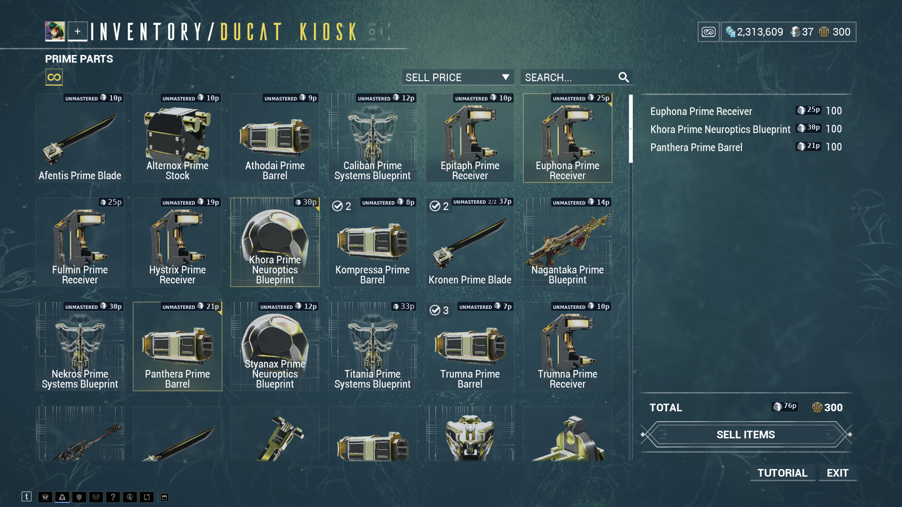
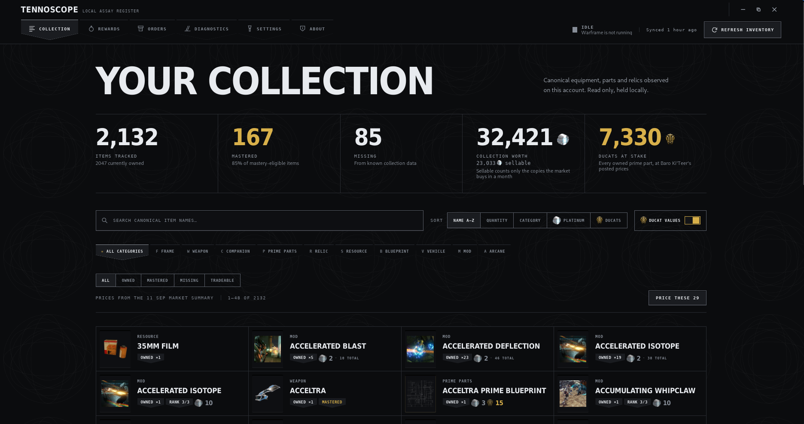
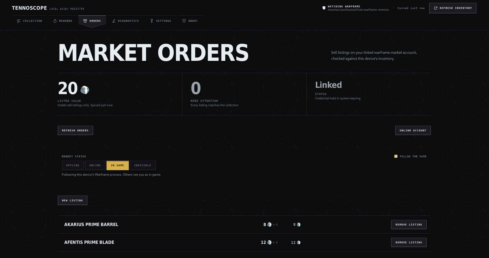
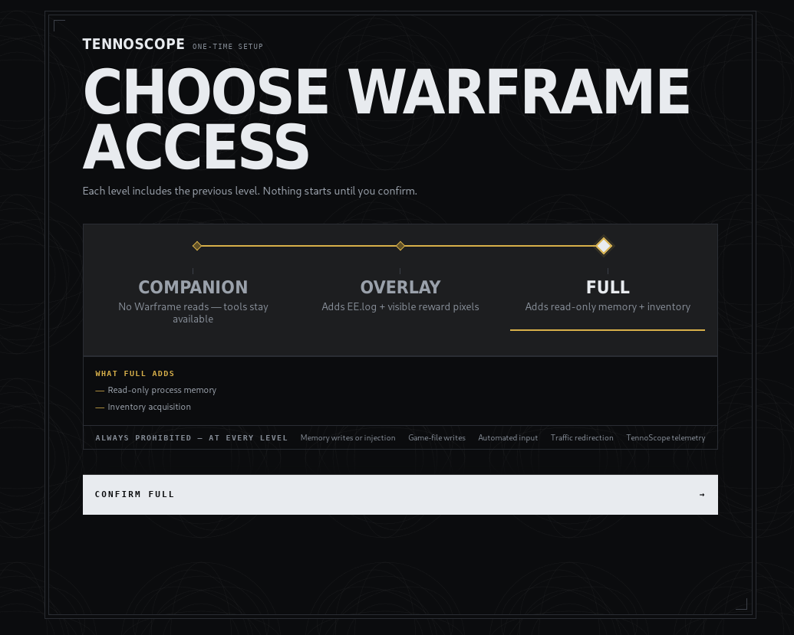

# TennoScope

**A free and open-source, Rust-based Warframe companion for Linux, Windows and the Steam Deck.
No Overwolf, no account, no telemetry.**

## Reward overlay

See platinum and ducats under each reward the moment it appears. TennoScope sees the
reward arrive in `EE.log`, reads the cards with Tesseract and draws the values under the
row. Each Prime part's slip also shows whether you have mastered the Prime it builds:
mastered, built and at what rank, in the foundry, or still unmastered, with the set behind
it drawn as part silhouettes and a ruled edge on the parts you are missing. A Lex, Bronco,
Magnus or Vasto Prime part keeps counting toward the Ak pistol that takes two of them, so
after you master a Lex Prime its parts can read "Unmastered Aklex". Those marks need the
inventory Full access syncs, so on Overlay access a slip can vouch only for what you have
already mastered and shows a dash otherwise. It prices the whole squad's relic pool using
sellers who are in game right now, without taking focus from the game.

## Ducat Kiosk overlay

Before you trade a Prime part for ducats, check what it is worth in platinum. TennoScope
puts a platinum figure on every tile of the grid, carries each pick into the sell list, and
totals the sell list as it fills. On a tile for a part of an item you have not mastered,
built or started building, the figure gives way to one strip: that the item is unmastered
and what the part sells for, plus, when you need the part more than once and the strip has
room, how many you hold against how many you need. Strips come from the same live
inventory, so on Overlay access every tile keeps its plain price.

## Collection

Open one screen for gear, Prime parts, relics, resources, blueprints, mods and arcanes.
Search by name, or filter to owned, mastered or missing gear. Full mode synchronizes when
the game starts; Companion and Overlay keep the last collection visible as a timestamped
saved snapshot.

See platinum and ducat values side by side, per item and across your collection. Market
prices come from a daily warframe.market trade summary, served by relics.run, with mods and
arcanes priced at their actual rank.

Prime parts use Baro Ki'Teer's posted ducat values. Sort by either currency or hide the
ducat figures when you only care about platinum.

## warframe.market integration

Connect warframe.market only if you want to. Once linked, TennoScope flags listings for
items you no longer own or that oversell what you hold. You can also list, delist and change
your online status without leaving the app.

## You decide what it may touch

Worried about third-party tools and your Warframe account? Fair. TennoScope asks
up front: run as a Companion that never looks at the game, add Overlay screen
reading for the reward advisor, or go Full for automatic inventory sync. Nothing
starts until you confirm, and no mode ever writes to the game, automates input,
or sends telemetry. Change your mind later and the lower mode retires everything it
no longer permits before the switch completes.

Mastery marks on the reward and kiosk overlays are a separate switch in Settings, on by
default. Turn them off and reward slips go back to their owned line and kiosk tiles to
their plain price.

> [!IMPORTANT]
> **Choose the access you want before TennoScope observes Warframe.** First run
> preselects Full and starts no running-game access until you confirm one. Full reads an
> account ID and a nonce from the Warframe process and sends them to
> `mobile.warframe.com`'s inventory endpoint and nowhere else. Overlay does not read process
> memory. TennoScope never writes to the game or automates an action. It is an unofficial
> project and is not endorsed by Digital Extremes.

## Install

| System | How |
| --- | --- |
| Windows 10 or 11 | [Installer](https://github.com/Deftera186/tennoscope/releases/latest) |
| Debian, Ubuntu | `sudo apt install tenno-scope` from this project's [APT repository](docs/install.md#debian-ubuntu-fedora) |
| Fedora | `sudo dnf copr enable deftera/tennoscope && sudo dnf install tennoscope` |
| Arch-based, incl. Steam Deck | `curl -O https://raw.githubusercontent.com/Deftera186/tennoscope/main/packaging/arch-bin/PKGBUILD && makepkg -si` |
| Gentoo | `games-util/tennoscope-bin` from the [`deftera`](https://github.com/Deftera186/deftera-overlay) overlay |
| Any other Linux | [AppImage](https://github.com/Deftera186/tennoscope/releases/latest) |

- **Windows:** use Borderless display mode in Warframe. Exclusive fullscreen prevents
  the overlay from appearing. SmartScreen will warn about the unsigned installer; choose
  "More info", then "Run anyway".
- **Linux:** Warframe runs through Wine or Proton. The overlays need `tesseract` with
  English language data, and Wine virtual-desktop mode also needs `xwininfo`. The
  collection works without either.
- **Screens:** both readers match the English item names in the catalog, so a
  non-English Warframe client is not read.

Need help with a particular distribution, building from source or process permissions?
See the [full install guide](docs/install.md).

## License

[GPL-3.0-only](LICENSE). TennoScope is an unofficial project and is not endorsed by
Digital Extremes. Warframe and its artwork belong to Digital Extremes; see
[THIRD_PARTY_NOTICES.md](THIRD_PARTY_NOTICES.md).

[Install guide](docs/install.md) · [Docs](docs/README.md) · [Contributing](CONTRIBUTING.md) · [Changelog](CHANGELOG.md) · [Security](SECURITY.md)

